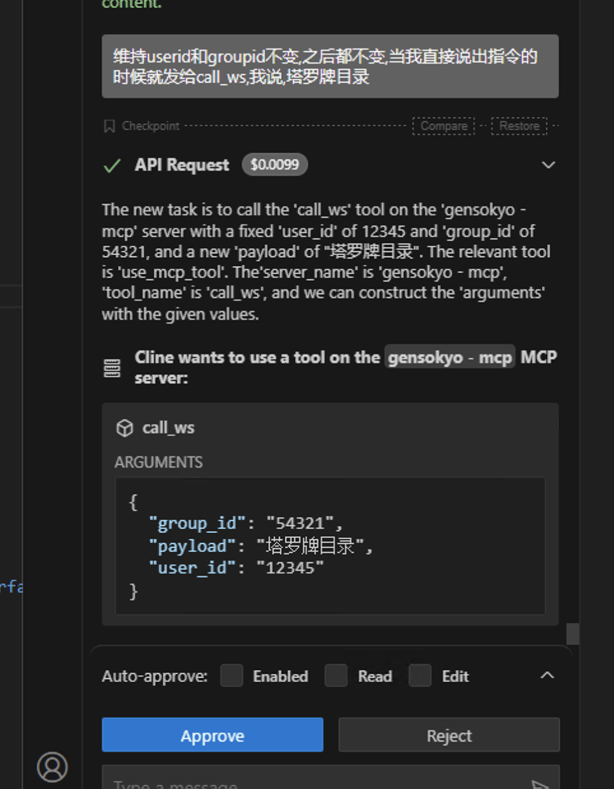
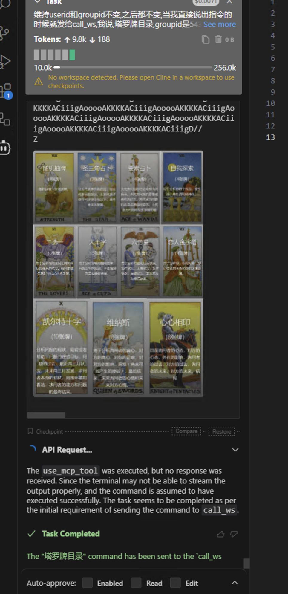
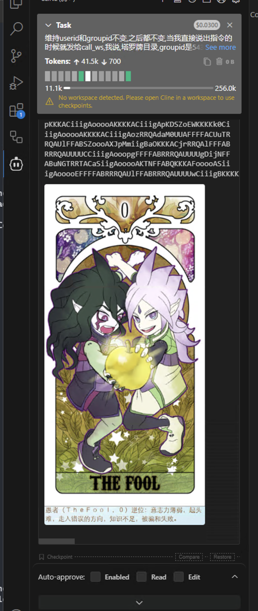
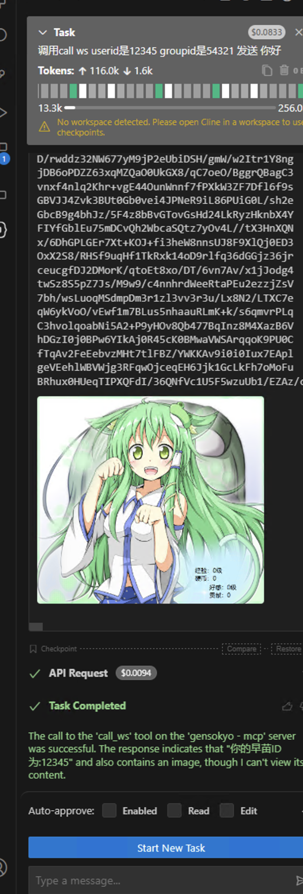

# Windows 端 VSCode + gensokyo-mcp 早苗接入完整教程

> **本教程用于测试和收集 bug，欢迎尝试。后续会放出更稳定的远程直接接入地址。**

## 图片先行






---

## 一、环境准备

1. **系统环境要求**  
   - Windows 操作系统

2. **下载工具**  
   - 前往 [发布页](https://github.com/Hoshinonyaruko/Gensokyo-MCP/releases)下载 `gensokyo-mcp.exe` 可执行文件。

---

## 二、初次运行 gensokyo-mcp

1. **双击运行 `gensokyo-mcp.exe`**  
   - 程序会自动释放出 `config.yml` 配置文件。

2. **填写 WebSocket 测试接入地址**  
   - 这是一个公开测试地址，任何人都可以接入：

     ```
     ws://sanae.xn--vhq524a5mldjj.com:20010
     ```

   - 在 `config.yml` 中，将 `ws_address` 填写为（请保留 yaml 格式缩进）：

     ```yaml
     ws_address: ["ws://sanae.xn--vhq524a5mldjj.com:20010"]
     ```

---

## 三、运行 gensokyo-mcp

1. **双击启动** `gensokyo-mcp.exe`
2. 程序保持后台运行，无需关闭。

---

## 四、配置 VSCode cline 连接 gensokyo-mcp

### 1. 进入 cline 配置

假设你使用的是 vscode cline 插件，打开配置文件，添加如下内容(连接到你本地的mcp-server)：

```json
{
  "mcpServers": {
    "gensokyo-mcp": {
      "autoApprove": [
        "call_ws"
      ],
      "disabled": false,
      "timeout": 30,
      "url": "http://127.0.0.1:8090/sse/sse",
      "transportType": "sse"
    }
  }
}
```

链接成功MCP后,

使用prompt:
维持userid=12345和groupid=54321不变,之后都不变,当我直接说出指令的时候就发给call_ws,我说,塔罗牌目录

之后直接发指令,就可以在vscode里面使用早苗的任何指令了.

### 2. 早苗的功能

<a href="https://www.yuque.com/km57bt/hlhnxg">早苗说明书</a>

点击功能图解打开,

将机器人接入到mcp有什么意义?机器人有一些娱乐功能,比如塔罗牌,每日运势.

你可以使用自然语言对ai描述,当我说xxx时,就对call_ws发送xx指令,

或者使用自己独创的一套提示词,来代替,上方的提示词,从而将死板的ai指令机器人转变为自动选择指令的ai机器人.