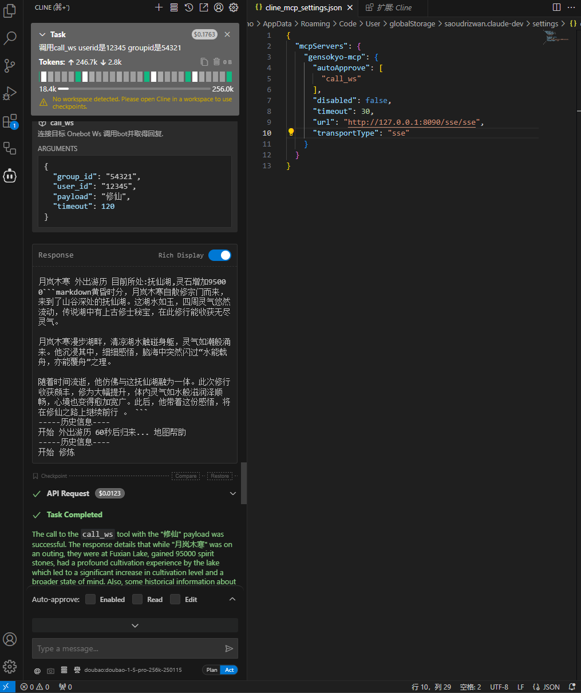
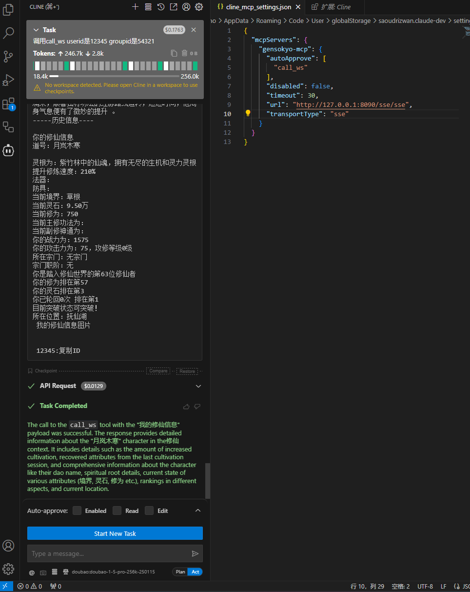

<p align="center">
  <a href="https://www.github.com/hoshinonyaruko/gensokyo">
    
  </a>
</p>

<div align="center">

# gensokyo

_✨ 基于 [OneBot](https://github.com/howmanybots/onebot/blob/master/README.md) MCP-Onebot机器人Api Golang 原生实现 ✨_  


</div>

<p align="center">
  <a href="https://raw.githubusercontent.com/hoshinonyaruko/gensokyo-mcp/main/LICENSE">
    
  </a>
  <a href="https://github.com/hoshinonyaruko/gensokyo-mcp/releases">
    
  </a>
  <a href="https://github.com/howmanybots/onebot/blob/master/README.md">
    
  </a>
  <a href="https://github.com/hoshinonyaruko/gensokyo-mcp/actions">
    
  </a>
  <a href="https://goreportcard.com/report/github.com/hoshinonyaruko/gensokyo">
  
  </a>
</p>

<p align="center">
  <a href="https://github.com/howmanybots/onebot/blob/master/README.md">文档</a>
  ·
  <a href="https://github.com/hoshinonyaruko/gensokyo-mcp/releases">下载</a>
  ·
  <a href="https://github.com/hoshinonyaruko/gensokyo-mcp/releases">开始使用</a>
  ·
  <a href="https://github.com/hoshinonyaruko/gensokyo-mcp/blob/master/CONTRIBUTING.md">参与贡献</a>
</p>
<p align="center">
  <a href="https://gensokyo.bot">项目主页:gensokyo.bot</a>
</p>


### 兼容性

**gensokyo** 兼容 [OneBot-v11](https://github.com/botuniverse/onebot-11)，详细信息请参考 OneBot 官方文档。
支持将 OneBot-v11 标准机器人的反向 WebSocket 作为 MCP Server。

以下项目均可无缝连接，包括：

* koishi
* nonebot2
* trss
* zerobot
* MiraiCQ
* hoshino
* tata
* 派蒙
* 炸毛
* 早苗
* 修仙
* yobot
* Mirai (Overflow)
* 以及其他支持 OneBot-v11 协议的相关项目

同时，**gensokyo** 支持连接至 VScode-Cline、Claude、OpenAI 以及各类支持 MCP 的应用平台，可以与其他支持 OneBot-v11 适配器的项目协同使用。

开发者和用户无需重新开发插件，可直接复用生态内的现有插件及使用体验。
项目持续完善中，欢迎加入交流群（196173384）参与测试或交流使用问题，欢迎随时提问，我们会及时为您解答与协助。

### 主要用途

* 开发者测试
* 截图展示
* 个人娱乐
* 工具使用与效率拓展


### MCP 服务使用方式

**第一步：启动服务**
运行 gensokyo 后，项目会自动释放 `config.yml` 配置文件。

**第二步：配置连接参数**
在 `config.yml` 中，设置需要连接的 OneBot-v11 反向 WebSocket 地址。

以 cline 为例，配置方式如下。请注意 `/sse/sse` 路径出现了两次，确保地址填写无误：

```json
{
  "mcpServers": {
    "gensokyo-mcp": {
      "autoApprove": [
        "call_ws"
      ],
      "disabled": false,
      "timeout": 30,
      "url": "http://127.0.0.1:8090/sse/sse",
      "transportType": "sse"
    }
  }
}
```

* 支持本地连接（如示例所示），也支持远程连接，只需将 `url` 换为对应地址即可。
* 其他 MCP 客户端的连接方式，可直接复制 cline 的配置模板，修改参数后使用。如有疑问，欢迎将配置发送至交流群，或询问 AI 获取针对性帮助。

## 教程索引

> [💙 Windows 端 VSCode-Cline + gensokyo-mcp 早苗接入完整教程](./doc/sanae.md)

**常见问题**
如遇到连接异常或配置相关问题，请加入交流群 196173384 进行反馈，我们将协助你快速解决。


### 效果图（连接修仙插件）

<div align="center">


<p>示例1：修仙插件界面</p>


<p>示例2：效果</p>

* 任何onebotv11的插件类型,比如天气\游戏查询\娱乐均可作为MCP Server使用. 即刻将数千个Onebotv11生态插件转化为ai工具

</div>

### 接口

由于本项目是由gensokyo-wxmp重构的，目前仅支持传递文本，仅支持反向ws方式连接Onebotv11机器人应用.

- [] HTTP API
- [] 反向 HTTP POST
- [] 正向 WebSocket
- [x] 反向 WebSocket

### 拓展支持

> 拓展 API 可前往 [文档](docs/cqhttp.md) 查看

- [x] 连接多个ws地址
- [x] 将MCP用户信息虚拟成群事件/私聊事件
- [x] 持续更新~


### 实现

<details>
<summary>已实现 API</summary>

#### 符合 OneBot 标准的 API

| API                      | 功能                   |
| ------------------------ | ---------------------- |
| /send_group_msg√         | [发送MCP回复消息]           |

</details>

<details>
<summary>已实现 Event</summary>

#### 符合 OneBot 标准的 Event（部分 Event 比 OneBot 标准多上报几个字段，不影响使用）

| 事件类型 | Event            |
| -------- | ---------------- |
| 消息事件 | [MCP信息虚拟私聊信息]TODO       |
| 消息事件 | [MCP信息虚拟群消息]         |

</details>

## 关于 ISSUE

以下 ISSUE 会被直接关闭

- 提交 BUG 不使用 Template
- 询问已知问题
- 提问找不到重点
- 重复提问

> 请注意, 开发者并没有义务回复您的问题. 您应该具备基本的提问技巧。  
> 有关如何提问，请阅读[《提问的智慧》](https://github.com/ryanhanwu/How-To-Ask-Questions-The-Smart-Way/blob/main/README-zh_CN.md)

## 性能

10mb内存占用 端口错开可多开 稳定运行无报错